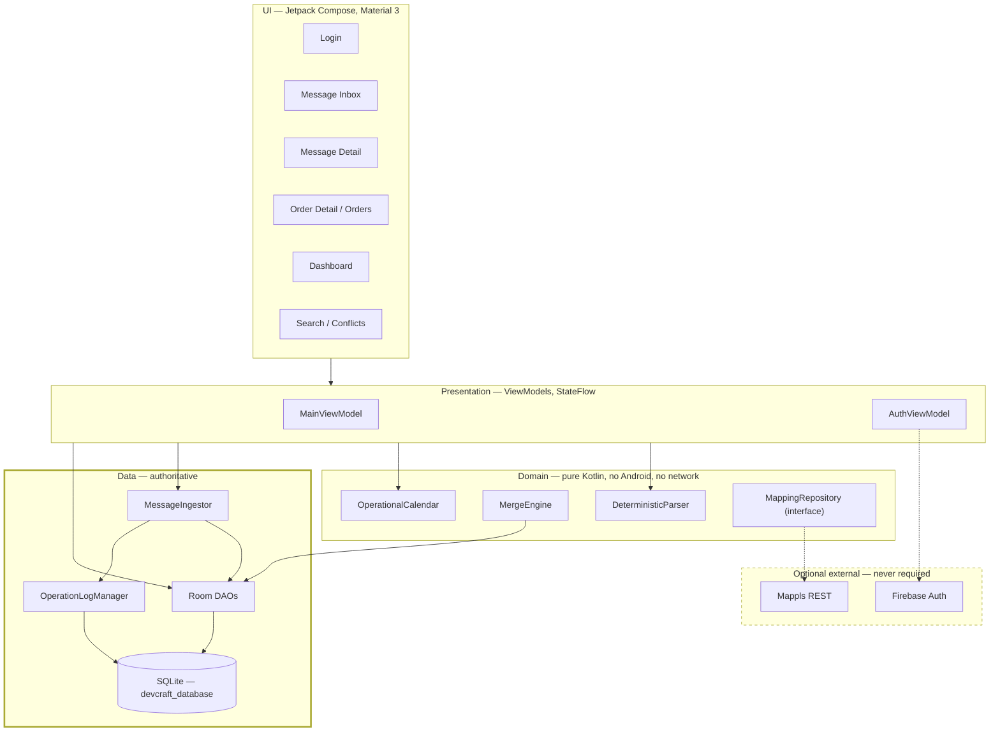
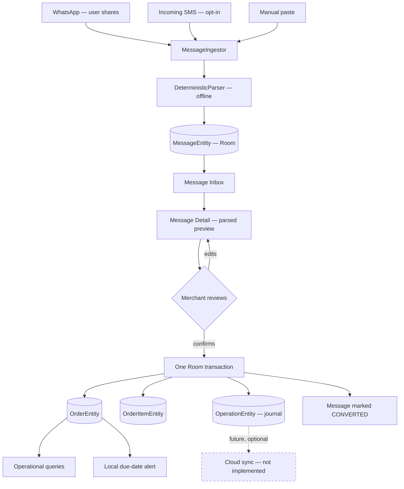

# DevCraft — Architecture

The single organising principle: **Room/SQLite is the source of truth, and every
cloud service is optional.** Firebase and Mappls enhance DevCraft. Neither may
sit on the path between a merchant and a saved order.

---

## Layers



Dashed = optional. Bold border = source of truth.

### Honest note on layering

This is **MVVM with the ViewModel talking directly to Room DAOs.** There is no
repository or use-case layer for orders. `CLAUDE.md` describes full Clean
Architecture; the code does not implement it. That is a deliberate MVP
simplification, recorded here rather than papered over.

What *is* properly abstracted: mapping (`MappingRepository`), ingestion
(`MessageIngestor`), conflict merging (`MergeEngine`), and auth
(`PhoneAuthRepository`) — each isolated because each has a real second
implementation (fake/unconfigured) or needs testing without Android.

---

## Message to order



**No step above performs a network request.** The dashed edge is the only cloud
interaction and it does not exist yet.

### Atomicity

Steps I–L are one `withTransaction`. Before this was fixed, they were eight
sequential DAO calls, so process death midway could leave an orphaned customer,
an order with no items, or a message marked `CONVERTED` pointing at an order that
was never written. Every mutation is now committed together with its
operation-log row — a change can never exist without its journal entry.

---

## Local vs optional

| Concern | Local / offline | Optional cloud |
| :--- | :--- | :--- |
| Cold start | ✅ Room | — |
| Message ingestion | ✅ | — |
| Parsing | ✅ deterministic rules | 🔴 no AI layer exists |
| Review & order creation | ✅ | — |
| Search & operational queries | ✅ SQL | — |
| Due-date alerts | ✅ AlarmManager | — |
| Conflict merge | ✅ pure function | — |
| Identity | ✅ cached session | ⚠️ Firebase Auth for first sign-in |
| Multi-device sync | 🔴 not implemented | ⚠️ Firestore, planned |
| Geocoding / routing | ✅ cached coords only | ⚠️ Mappls REST |

Degradation is designed, not accidental:

- **No `google-services.json`** → `FirebaseApp` never initialises,
  `PhoneAuthRepository.isAvailable` is false, the login screen is skipped
  entirely. The Google Services Gradle plugin is applied conditionally so the
  build stays green.
- **No `MAPPLS_API_KEY`** → `MappingProvider` returns
  `UnconfiguredMappingRepository`, which reports `NotConfigured`. No HTTP call is
  even attempted. It does not return a fake success — a demo must not look live
  when it isn't.
- **Network loss mid-request** → `IOException` is classified as
  `MappingResult.Offline`, so callers fall back to cached coordinates.

---

## Data model

Room schema version **3**.

| Entity | Role |
| :--- | :--- |
| `MessageEntity` | inbound message; `originalText` is immutable |
| `CustomerEntity` | customer + optional cached geocode |
| `OrderEntity` | header, ISO-8601 `dueDate`, optional location |
| `OrderItemEntity` | line items, `attributesJson` |
| `OperationEntity` | append-only change journal |
| `ConflictEntity` | every losing value, for inspection |

Migrations are additive and non-destructive:

| Migration | Change |
| :--- | :--- |
| `1 → 2` | create `messages` |
| `2 → 3` | nullable location columns on `orders` and `customers` |

`fallbackToDestructiveMigration()` was **removed**. It would silently wipe every
order a merchant had entered if a migration were ever missed; crashing on an
unhandled upgrade is strictly better than losing the source of truth.

`dueDate` is stored as ISO-8601 text, so lexicographic comparison is
chronological and every due/overdue/this-week question is a plain SQL comparison
with no date conversion.

**Known gaps:** no `@Index` or `@ForeignKey` on any entity (searches are table
scans), no FTS4 (search is `LIKE '%…%'`), `exportSchema = false` so there is no
schema JSON to diff.

---

## Operation log

Every create/update/delete appends an `OperationEntity` inside the same
transaction as the mutation. `deviceId` is persisted in `SharedPreferences` —
previously it was regenerated per ViewModel, so every launch looked like a new
device and attribution was meaningless.

`changedFieldsJson` holds only mutated fields, not whole records.

---

## Conflict convergence

Field-level merge on a **total order**, highest wins:

1. `timestamp`
2. `deviceId`, lexically
3. `operationId`, final stable tie-break

`operationId` is a unique UUID, so no two operations ever compare equal. The
order is total, therefore **any permutation of the same operation set yields the
identical winner.** That is the convergence guarantee, and `MergeEngineTest`
asserts it by running each scenario through *all* permutations rather than one
chosen arrival order.

| Case | Outcome |
| :--- | :--- |
| Disjoint fields | both survive, no conflict logged |
| Same field | higher precedence wins, loser recorded |
| Equal timestamps | `deviceId` decides |
| Equal device + timestamp | `operationId` decides |
| Delete vs later update | update survives; delete intent surfaced |
| Update vs later delete | delete wins; lost edit surfaced |

No losing value is discarded — each becomes a `ConflictEntity` row.

**Limitation:** ordering uses the wall-clock `timestamp` column, not a Hybrid
Logical Clock. It converges deterministically but cannot detect causality, so a
skewed clock can win a race it did not causally win. The comparator in
`MergeEngine` is the only place that changes when HLC lands.

**Also:** exercised by tests, not by a live remote source — there is no sync
transport yet.

---

## Parser

Rule-based, deterministic, offline. No model, no network.

Tokenised on `[^\p{L}\p{M}\p{N}.]+` with whole-token matching. `\p{M}` is
essential: Devanagari matras and anusvara are combining marks, so without it
`परसों` shreds to `परस` and `बोरी` to `बोर`.

Why tokens and not substrings — the original substring approach produced:
`"10 bori"` → quantity **1** (text contains `"1"`); `"5 chairs … Rs 2500"` →
quantity **2**; `"cars 500"` → an amount of 500. All now have regression tests.

Confidence is derived from what actually resolved, so the ambiguity guard can
fire. Missing fields stay `null` rather than being guessed.

---

## Alerts

`AlarmManager.setExactAndAllowWhileIdle`, guarded by `canScheduleExactAlarms()`
on API 31+, degrading to inexact rather than dropping the reminder. Fires 09:00
local on the due date, deep-links to the order, re-armed after reboot from Room
by `BootReceiver`, cancelled when an order is completed, cancelled or deleted.

`POST_NOTIFICATIONS` is requested at runtime — it was previously declared but
never requested, so every alert was silently dropped on Android 13+.

---

## Threading

| Work | Where |
| :--- | :--- |
| UI state | Compose + `StateFlow` |
| DB writes, parsing | `viewModelScope` on `Dispatchers.IO` |
| Broadcast receivers | `goAsync()` + IO coroutine |
| Reactive reads | Room `Flow` → `stateIn(WhileSubscribed(5000))` |
| Mapping HTTP | `withContext(Dispatchers.IO)` inside the repository |

Room `Flow` queries are never collected inside a transaction — the customer
lookup on the conversion path is a suspend query specifically to avoid that
deadlock.

---

## Module map

```
app/src/main/java/com/devcraft/
├── alerts/          LocalAlertScheduler · OrderDueReceiver · BootReceiver
├── auth/            PhoneAuthRepository            (optional)
├── data/
│   ├── ingest/      MessageIngestor               (all channels converge here)
│   └── local/       entities · dao · DevCraftDatabase + migrations
├── domain/          ParsedMessage · OperationalCalendar
├── mapping/         MappingRepository · Mappls · Fake · Provider  (optional)
├── parser/offline/  DeterministicParser
├── sms/             SmsReceiver                    (opt-in)
├── sync/
│   ├── conflict/    MergeEngine · DeterministicConflictResolver
│   └── engine/      OperationLogManager
└── ui/              MainViewModel · AuthViewModel · screens/ · theme/
```

---

## Design decisions

| Decision | Reason |
| :--- | :--- |
| Room, not Firestore, as truth | connectivity is unreliable where this is used |
| Rule-based parser, not an LLM | must work offline, and be debuggable and repeatable |
| One `MessageIngestor` for all channels | one parser, one pipeline; the channel only sets `source` |
| Pure `MergeEngine`, separate persistence | lets convergence be proven over all permutations |
| Total order incl. `operationId` | guarantees permutation-invariance without a schema migration |
| OkHttp, not Retrofit | three endpoints; Retrofit adds a layer for nothing |
| Gson, not `org.json` | `org.json` is stubbed in JVM unit tests |
| Conditional google-services plugin | absent config must not break the build |
| Millis passed into `OperationalCalendar` | makes date windows unit-testable |
| `applicationId` ≠ `namespace` | new app identity without renaming 44 files |

---

## What is not built

🔴 Sync transport (`SyncWorker`, Firestore push/pull) · Hybrid Logical Clocks ·
AI enhancement layer · map screen UI · indices and FTS4 · dark theme ·
string externalisation · release signing · instrumented tests.

WorkManager is a declared dependency that is **not used**.
