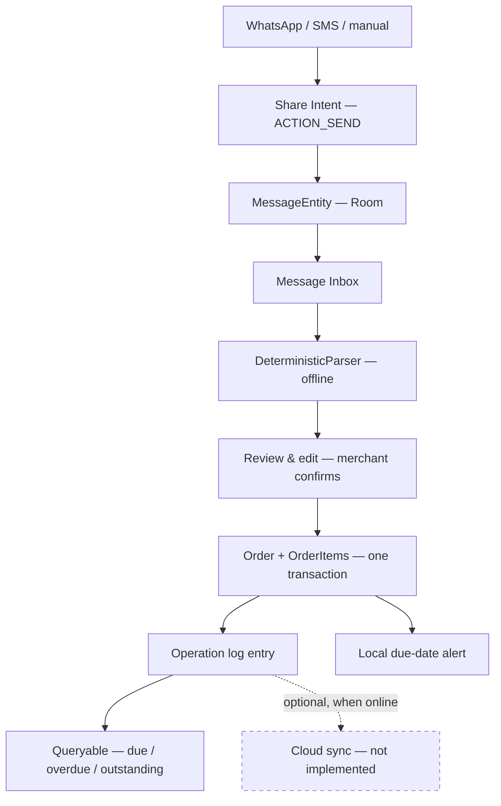
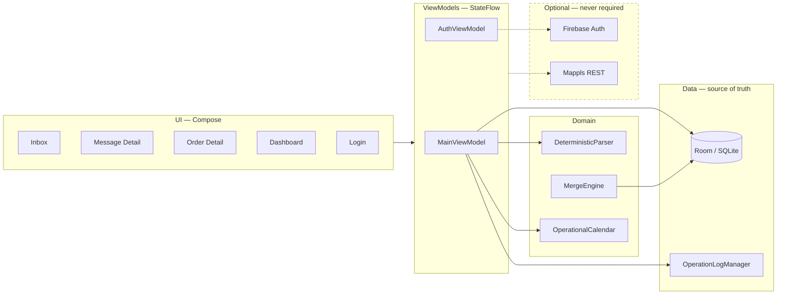

# DevCraft

**Offline-first conversational order management for small businesses.**

*DevCraft by Neutron*

[](#)
[](#)
[](#)
[](#)
[](#)
[](#)

---

## What DevCraft does

A merchant gets an order over WhatsApp as a sentence, not a form:

> *"Ramesh bhaiya ko kal shaam 10 bori cement bhejo Rs 3500"*

DevCraft turns that into a structured order — customer, quantity, item, due date,
amount — reviewed and confirmed by the merchant, stored locally, and surfaced
later through operational queries like *what's due today* and *who owes money*.

It is a **native Android app**. Kotlin, Jetpack Compose, Room/SQLite. Not a web
app, not a wrapper.

### Problem

Small manufacturers and traders in India take orders conversationally, in mixed
Hindi/English/Hinglish, across WhatsApp and SMS. Those orders live in chat
history. There is no due-date list, no outstanding total, no record of what a
customer ordered last time and to what specification.

### Why it matters

The workshops that most need this have the least reliable connectivity. Any tool
that stalls on a network request when the phone has no signal will not be used.
So the constraint is not "works offline too" — it is **offline is the primary
path, and the cloud is optional**.

---

## Status at a glance

Legend: ✅ working and tested · 🟡 implemented, needs device verification ·
🟠 configuration required · ❌ not implemented

| Capability | Status | Notes |
| :--- | :--- | :--- |
| Build & APK | ✅ | `assembleDebug` green, 20.3 MB APK |
| Unit tests | ✅ | 64 passing |
| Deterministic multilingual parser | ✅ | English / Hindi / Hinglish / Devanagari |
| Room persistence, atomic writes | ✅ | single transaction per conversion |
| Operation log | ✅ | append-only, every mutation |
| Conflict convergence | ✅ | permutation-invariant, 3 scenarios tested |
| Offline query layer | ✅ | due/overdue/outstanding/history/capacity |
| Branding & launcher icon | ✅ | geometric D mark, adaptive icon |
| WhatsApp Share ingestion | 🟡 | code complete, not yet run on a phone |
| Local due-date alerts | 🟡 | exact alarms, deep link, reboot re-arm |
| Room migrations v1→v2→v3 | 🟡 | additive, non-destructive |
| Phone/OTP authentication | 🟠 | needs `google-services.json` |
| Mappls (MapMyIndia) mapping | 🟠 | needs `MAPPLS_API_KEY` |
| Firebase cloud sync | ❌ | transport not implemented |
| SMS receiver | ❌ | not implemented |
| Hybrid Logical Clocks | ❌ | wall-clock ordering used instead |
| Map screen UI | ❌ | repository layer only |

Nothing above is marked ✅ unless it was actually built and tested in this repo.

---

## Core user journey



**No step on this path performs a network request.** The dashed edge is the only
cloud interaction and it does not exist yet.

---

## Architecture



Honest note: this is **MVVM with direct DAO access from the ViewModel**, not the
full Clean Architecture layering described in `CLAUDE.md`. There is no repository
or use-case layer for orders. That is a deliberate simplification for an MVP, not
an accident — but the docs previously claimed otherwise.

---

## Offline-first design

Room is the source of truth. Firebase is an identity/relay layer. Mappls is an
enrichment layer. Neither can block the core workflow.

| Works with no network | Requires network |
| :--- | :--- |
| Cold start | Sending an OTP (inherent to SMS) |
| Message ingestion & persistence | Geocoding / routing |
| Parsing | Cloud sync (not implemented) |
| Review, edit, confirm | |
| Order & item creation | |
| Search and all operational queries | |
| Local due-date alerts | |
| Conflict viewing | |
| Reading a cached auth session | |

Guarantees implemented:
- **Atomic writes.** Conversion runs in one `withTransaction`, so process death
  cannot leave an order without items or a message marked converted pointing at
  nothing.
- **No destructive migrations.** `fallbackToDestructiveMigration()` was removed —
  it would silently wipe every order if a migration were ever missed.
- **Stable device identity.** Persisted in `SharedPreferences`, not regenerated
  per ViewModel.
- **Auth cannot lock you out.** No Firebase config ⇒ login is skipped. Config
  present but offline ⇒ *"Continue offline without signing in"*.

---

## Parser

Rule-based and deterministic. No model, no network, no LLM.

Token-based throughout — split on `[^\p{L}\p{M}\p{N}.]+` and match whole tokens.
`\p{M}` is essential: Devanagari matras and anusvara are combining marks, so
without it `परसों` shreds to `परस`.

| Handles | Example |
| :--- | :--- |
| Devanagari numerals | `१०`, `५`, `३` → 10, 5, 3 |
| Hindi number words | `ek`…`das`, `sau`, `hazaar` |
| Compound quantities | `do sau` → 200 |
| Fractions | `dedh` → 2, `dhai` → 3 (rounded up) |
| Relative dates | `aaj`/`आज`, `kal`/`कल`, `parso`/`परसों`, `next week` |
| Currency-gated amounts | `Rs 3500`, `₹450`, `3500 rupees` |
| Honorific-anchored names | `Ramesh bhaiya`, `सुरेश भाई`, `Mohan ji` |
| Prior-order references | `wahi purana`, `same as last` |
| Attributes | colour, `chest 40` / `size 42` |

Bugs fixed from the original implementation — each has a regression test:
- `"10 bori"` scored quantity **1** (text contains the substring `"1"`)
- `"5 chairs … Rs 2500"` scored quantity **2** (contains `"2"`)
- `"आज ही चाहिए"` resolved **no** due date (only ASCII `aaj` was matched)
- `"cars 500"` matched `rs 500` as an amount
- `needs_clarification` was permanently `false` — quantity defaulted to 1 and the
  customer fell back to the literal string `"Customer"`, pinning confidence at 0.95

Confidence is now derived from what actually resolved, so the ambiguity guard can
fire. Missing fields stay `null` rather than being guessed.

**Not yet aligned to the competition dataset.** `messages_train.json`,
`schema.json`, `DATASET_CARD.md`, `score.py`, `sample_submission.json` and
`conflict_scenarios.md` are **not present in this repo** (`competition/` is
empty). So there is **no parser accuracy score to report**, and these
`DATASET_CARD.md` rules are unimplemented: `narsu`/`tarso`, strict next-weekday,
`N tarikh`, `received_at` as date anchor, negated items/customers/prior-order,
urgency decoys, detached attributes, closed attribute vocabulary. Add the files
and this unblocks.

---

## Conflict resolution

Field-level merge with a **total order**, highest wins:

1. `timestamp`
2. `deviceId`, lexically
3. `operationId`, final stable tie-break

Because `operationId` is a unique UUID, no two operations compare equal. The
order is total, so **any permutation of the same operation set yields the
identical winner** — that is the convergence guarantee, and the tests assert it
by running every scenario through *all* permutations rather than one arrival
order.

| Scenario | Behaviour | Test |
| :--- | :--- | :--- |
| Disjoint fields | both survive, no conflict logged | ✅ |
| Same field | higher precedence wins, loser recorded | ✅ |
| Identical timestamps | `deviceId` breaks the tie | ✅ |
| Same device & timestamp | `operationId` breaks the tie | ✅ |
| Delete vs later update | update survives, delete intent surfaced | ✅ |
| Update vs later delete | delete wins, lost edit surfaced | ✅ |

No losing value is ever discarded — each becomes a `ConflictEntity` row visible
in the Conflicts screen.

**Limitation:** ordering uses the wall-clock `timestamp` column, not a true
Hybrid Logical Clock. It converges deterministically but cannot detect causality,
so a device with a skewed clock can win a race it did not causally win. The
comparator in `MergeEngine` is the only place that changes when HLC is added.

**Also:** this is exercised by tests, not by a live remote source — there is no
sync transport yet.

---

## Ingestion: what is and is not supported

| Channel | Status | How |
| :--- | :--- | :--- |
| WhatsApp **Share** | 🟡 implemented | `ACTION_SEND` `text/plain`. User shares a message into DevCraft. |
| Manual paste | ✅ | Paste Message screen |
| Android **SMS receiver** | ❌ | `SMS_RECEIVED` broadcast — not implemented. Would use the phone's own SIM; no external GSM hardware is needed. Play Store SMS-permission policy is restrictive. |
| WhatsApp Business API | ❌ | Out of scope |
| Reading WhatsApp's database | ❌ **never** | Private app storage. Not attempted. |

DevCraft has **no access to a WhatsApp inbox.** The user explicitly shares each
message. Any claim otherwise would be false.

---

## Database

Room, schema version 3.

| Entity | Purpose |
| :--- | :--- |
| `MessageEntity` | raw inbound message, immutable original text |
| `CustomerEntity` | customer + optional cached geocode |
| `OrderEntity` | order header, ISO-8601 `dueDate`, optional location |
| `OrderItemEntity` | line items with `attributesJson` |
| `OperationEntity` | append-only change journal |
| `ConflictEntity` | every losing value, for merchant inspection |

Migrations are additive: `v1→v2` adds `messages`, `v2→v3` adds nullable location
columns to `orders` and `customers`.

Known gaps: no `@Index` or `@ForeignKey` on any entity (searches are table
scans), no FTS4 — search is `LIKE '%…%'`, and `exportSchema = false` so there is
no schema JSON to diff.

---

## Alerts

`AlarmManager.setExactAndAllowWhileIdle`, guarded by `canScheduleExactAlarms()`
on API 31+, degrading to inexact rather than dropping the reminder. Fires at
09:00 local on the due date, deep-links to the order, and re-arms after reboot
from Room via `BootReceiver`. Cancelled when an order is completed, cancelled or
deleted.

`POST_NOTIFICATIONS` is requested at runtime — previously declared but never
requested, so every alert was silently dropped on Android 13+.

---

## Tech stack

| Layer | Choice |
| :--- | :--- |
| Language | Kotlin 1.9.22 |
| UI | Jetpack Compose, Material 3 |
| Database | Room 2.6.1 / SQLite |
| Async | Coroutines, Flow / StateFlow |
| Build | Gradle 8.6, AGP 8.2.2, KSP |
| HTTP | OkHttp 4.12 (Mappls only) |
| JSON | Gson 2.10.1 |
| Auth | Firebase Auth (optional) |
| Tests | JUnit 4, MockWebServer |
| Min / target SDK | 26 / 34 |

---

## Project structure

```
app/src/main/java/com/devcraft/
├── alerts/        LocalAlertScheduler, OrderDueReceiver, BootReceiver
├── auth/          PhoneAuthRepository — optional
├── data/local/    entities, DAOs, DevCraftDatabase + migrations
├── domain/        ParsedMessage, OperationalCalendar
├── mapping/       MappingRepository, Mappls + Fake impls
├── parser/offline/ DeterministicParser
├── sync/          OperationLogManager, MergeEngine, ConflictResolver
└── ui/            MainViewModel, AuthViewModel, screens/, theme/
```

---

## Setup & build

Requires JDK 17 and the Android SDK (platform 34, build-tools 34.0.0).

```powershell
# local.properties (gitignored)
sdk.dir=C:\\Users\\<you>\\AppData\\Local\\Android\\Sdk
MAPPLS_API_KEY=                # optional; blank disables mapping cleanly
```

```powershell
./gradlew assembleDebug          # debug APK
./gradlew testDebugUnitTest      # 64 unit tests
./gradlew assembleRelease        # needs a signing config — see release/INSTALL.md
./gradlew clean
```

APK path: `app/build/outputs/apk/debug/app-debug.apk`

```bash
adb install -r app/build/outputs/apk/debug/app-debug.apk
```

Release artifacts are staged in `release/` with `SHA256SUMS.txt` and `INSTALL.md`.
The APK itself is gitignored — ship it as a GitHub Release asset.

---

## Physical-device test checklist

Not yet executed — no device was available.

1. Install, launch — inbox appears with no login (no Firebase config)
2. Grant the notification prompt (Android 13+)
3. WhatsApp → long-press an order message → Share → DevCraft
4. **Cold start:** force-stop DevCraft first, then share — verify it opens the
   message detail directly (this race was fixed but is unverified)
5. Review, edit a field, **Confirm & Create Room Order**
6. Order Detail → change status → verify the badge updates immediately
7. Dashboard → check Due Today / Overdue / Outstanding tiles
8. Set a due date ~2 minutes out, wait for the notification, tap it → order opens
9. Reboot the phone → confirm the alert still fires
10. Airplane mode → create, search, edit, delete → all must work
11. Force-stop, reopen → data intact

---

## Optional cloud & AI

**Firebase** is identity only right now. Project `devcraft-by-neutron` (Spark).
One manual step remains: place `google-services.json` at `app/google-services.json`.
Full console instructions, including the debug SHA-1/SHA-256 and why a test phone
number is the right choice for a live demo, are in
[`docs/FIREBASE_SETUP.md`](docs/FIREBASE_SETUP.md).

**AI enhancement is not implemented and not connected.** The intended design, if
added, is: deterministic parser runs first and always; only low-confidence
results may consult an online model; the response is schema-validated and
rejected if invalid; any failure falls back to the deterministic result. AI must
never be on the critical path. No API key exists and no such call is made today.

**Mappls / MapMyIndia** has a complete provider boundary
(`MappingRepository` → `MapplsMappingRepository`) covering geocoding, reverse
geocoding and routing, with 15 tests that run without credentials. Unverified
against the live service — no API key.

---

## Limitations

- Nothing has been verified on a physical device.
- No parser accuracy score — dataset files absent.
- No cloud sync; the operation log accumulates locally.
- Wall-clock conflict ordering, not HLC.
- Light theme only; ~30 hardcoded light-mode hex colours remain in the screens.
- UI strings are hardcoded in Kotlin — no localization, despite multilingual parsing.
- `isOnline` on the dashboard is a manual toggle, not real connectivity detection.
- No indices or FTS; search is `LIKE`.
- Item quantity/description are not editable in the review screen (only customer,
  date, amount).
- No release signing configuration.

---

## Roadmap

1. Physical-device verification of the share → order → alert path
2. Dataset alignment and a real parser score
3. Sync transport wiring the merge engine to Firestore via WorkManager
4. HLC on `OperationEntity`
5. Map screen consuming the mapping boundary
6. SMS receiver
7. Indices + FTS4
8. Dark theme and string extraction

---

## Commit history

| Commit | Change |
| :--- | :--- |
| `a77f6b9` | optional Firebase phone/OTP sign-in |
| `8d0f8cc` | offline operational query layer |
| `ba4098f` | deterministic conflict convergence + scenario tests |
| `77bbfc4` | Mappls integration boundary + credential config |
| `603d4e6` | optional location fields + migration v2→v3 |
| `05563a0` | Firebase dependencies behind optional config |
| `9f8f9a1` | gitignore hardening for secrets |
| `be46a7c` | harden local due-date notifications |
| `e5a4fab` | make the message→order path work end to end |
| `79fed1d` | stabilize multilingual parser extraction |
| `d34dba5` | DevCraft brand identity + launcher icon |
| `6ae3387` | restore reproducible Android build |

Earlier commits (`3fe3743`…`1f54bae`) are the original Phase 1–2 foundation.

---

## Security

- No secrets in the repo. `.gitignore` blocks `google-services.json`,
  `service-account*.json`, `*.jks`, `*.keystore`, `*.p12`, `*.pem`,
  `local.properties`, `secrets.properties`.
- `MAPPLS_API_KEY` is injected from `local.properties` into `BuildConfig` at build
  time — never hardcoded. Absent key ⇒ no HTTP request is attempted at all.
- No passwords stored, ever. Phone auth uses Firebase; no custom OTP backend, no
  hardcoded OTPs.
- Firestore is not enabled. Rules for when it is are in the setup doc, and are
  scoped to `request.auth.uid` — never `if true`.

## License

Apache License 2.0.
