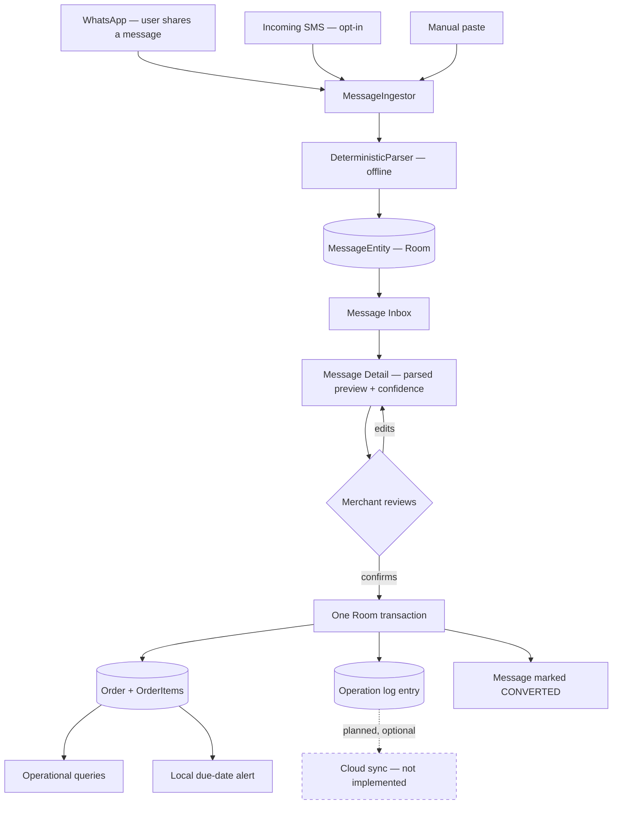
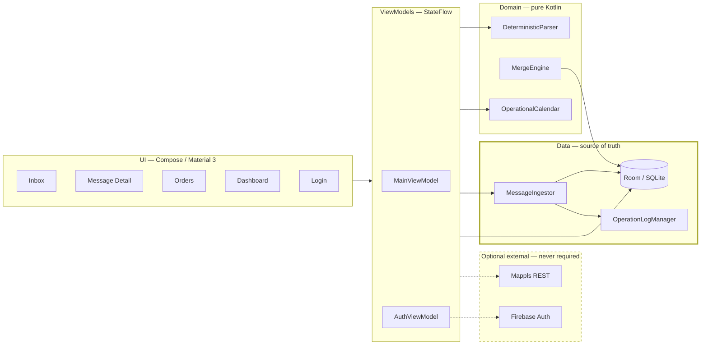

# DevCraft by Neutron

**Offline-First Smart Order Management for Real-World Messages**


> Status badges above reflect values actually measured in this repository. There
> are no CI, coverage, or deployment badges, because there is no CI, no coverage
> tooling, and nothing deployed.

---

## Current Status

Vocabulary: ✅ Implemented · 🟡 Partial / In Progress · 🔴 Not Implemented ·
⚠️ Requires external configuration

| Area | Status | Note |
| :--- | :--- | :--- |
| Offline-first core | ✅ Implemented | zero network calls on the order path |
| Room database | ✅ Implemented | schema v3, additive migrations |
| Message ingestion | ✅ Implemented | one shared pipeline, three channels |
| WhatsApp Share | 🟡 Partial | `ACTION_SEND` verified in APK; not device-tested |
| SMS ingestion | 🟡 Partial | receiver verified in APK; needs a SIM + policy caveat |
| Parser | ✅ Implemented | English / Hindi / Hinglish / Devanagari |
| Order conversion | ✅ Implemented | single atomic transaction |
| Operation log | ✅ Implemented | append-only, same transaction as the mutation |
| Conflict handling | ✅ Implemented | permutation-invariant; not wired to a live peer |
| Local alerts | 🟡 Partial | exact alarms + reboot re-arm; delivery unverified |
| Query layer | ✅ Implemented | due / overdue / outstanding / history / capacity |
| Branding & launcher icon | ✅ Implemented | geometric D mark, adaptive icon |
| Firebase | ⚠️ Requires configuration | needs `app/google-services.json` |
| Authentication | ⚠️ Requires configuration | phone/OTP built; live SMS unverified |
| Cloud sync | 🔴 Not Implemented | no transport; log accumulates locally |
| Hosting | 🔴 Not Applicable | native APK — there is no web artifact to host |
| GSM hardware | 🔴 Not Implemented | and not needed; see [GSM](#gsm-status) |
| Mapping (Mappls) | ⚠️ Requires configuration | boundary + 15 tests; no API key |
| AI enhancement | 🔴 Not Implemented | no API connected, no key |
| Debug APK | ✅ Implemented | 20.5 MB, builds green |
| Release APK | 🔴 Not Implemented | no signing keystore configured |

Nothing is marked ✅ unless it was built **and** tested in this repository.
Full evidence: [`docs/FINAL_QA.md`](docs/FINAL_QA.md).

---

## Project Overview

DevCraft turns conversational messages into structured orders, entirely on the
phone. A merchant receives an order as a sentence, not a form:

> *"Ramesh bhaiya ko kal shaam 10 bori cement bhejo Rs 3500"*

DevCraft extracts the customer, quantity, item, due date and amount; the merchant
reviews and confirms; the order is saved locally and becomes queryable — *what's
due today*, *who owes money*, *what did this customer order last time*.

It is a **native Android application**. Kotlin, Jetpack Compose, Room/SQLite.
Not a web app, not a wrapper.

## Problem Statement

Small manufacturers and traders in India take orders conversationally, in mixed
Hindi/English/Hinglish, over WhatsApp and SMS. Those orders live in chat history.
There is no due-date list, no outstanding total, no record of what a customer
ordered previously or to what specification. Orders get missed, quantities get
misremembered, and money owed is tracked from memory.

## Why DevCraft

The workshops that need this most have the least reliable connectivity. Any tool
that stalls on a network request when there is no signal simply won't be used.

So the constraint is not *"works offline too"* — it is **offline is the primary
path and the cloud is strictly optional**. That single decision shapes every
other one in this codebase.

## Core Idea

Do not ask a merchant to re-type an order they already received. Read the message
they already have, propose a structured interpretation, and let a human confirm
it. Determinism over cleverness: the same message always parses the same way, and
the merchant always gets the final say.

---

## Main User Flow



**No step on this path performs a network request.**

## Architecture



Dashed = optional. Bold = authoritative. Detail in
[`ARCHITECTURE.md`](ARCHITECTURE.md).

**Honest note:** this is MVVM with the ViewModel calling Room DAOs directly.
There is no repository/use-case layer for orders, despite `CLAUDE.md` describing
full Clean Architecture. Deliberate MVP simplification, documented rather than
hidden.

---

## Tech Stack

| Layer | Choice |
| :--- | :--- |
| Language | Kotlin 1.9.22 |
| UI | Jetpack Compose, Material 3 |
| Database | Room 2.6.1 / SQLite |
| Async | Coroutines, Flow / StateFlow |
| Build | Gradle 8.6, AGP 8.2.2, KSP |
| HTTP | OkHttp 4.12 — mapping only |
| JSON | Gson 2.10.1 |
| Auth | Firebase Auth (optional) |
| Tests | JUnit 4, MockWebServer |
| Min / target SDK | 26 / 34 |
| Application ID | `com.neutron.devcraft` |

---

## Message Ingestion

Three channels converge on one component, `MessageIngestor`. There is exactly
**one parser** and one pipeline — the channel only sets the `source` value.

| Channel | Source value | Status |
| :--- | :--- | :--- |
| WhatsApp Share | `WHATSAPP_SHARE` | 🟡 verified in APK, not device-tested |
| Incoming SMS | `SMS` | 🟡 verified in APK, needs a SIM |
| Manual paste | `MANUAL` | 🟡 code complete |

### WhatsApp Share workflow

```
WhatsApp → long-press message → Share → DevCraft
        → ACTION_SEND (text/plain) → MessageEntity → Parser → Review → Order
```

Verified present in the merged manifest of the built APK: `ACTION_SEND` with
`android:mimeType="text/plain"`, plus `launchMode="singleTask"` and
`onNewIntent`, so sharing into an already-running app works as well as a cold
start.

**DevCraft has no automatic WhatsApp inbox access and does not attempt any.**
WhatsApp history lives in that app's private storage; reading it would require
root or an exploit. The user chooses and shares each message deliberately.

| Approach | Status |
| :--- | :--- |
| Share Intent | ✅ the supported path |
| Reading WhatsApp's database | 🔴 never — private storage |
| Notification scraping | 🔴 not implemented |
| WhatsApp Business Cloud API | 🔴 out of scope |

### SMS status

**Implemented and registered, but not device-verified — and constrained by Play
Store policy, not by the API.**

Receiving SMS does **not** require being the default SMS app. `RECEIVE_SMS` plus
observing the `SMS_RECEIVED` broadcast is sufficient; only `SMS_DELIVER`, writing
to the SMS provider, and sending-as-default need handler status, and DevCraft
does none of those.

Verified in the shipped APK: the `RECEIVE_SMS` permission, the
`com.devcraft.sms.SmsReceiver` registration, and the `SMS_RECEIVED` intent-filter.

- Receiver is `exported="true"` (system broadcast) but guarded by
  `android:permission="android.permission.BROADCAST_SMS"`, so another app cannot
  forge a fake incoming order.
- Permission is requested **only** when the merchant taps *Enable* beside
  *"SMS order capture"* on the dashboard — never at startup.
- Multipart SMS is reassembled from its PDUs before parsing.
- Authentication SMS is filtered out, so DevCraft's own login OTP never lands in
  the order inbox. 7 tests cover this, including negative cases proving real
  Hinglish and Devanagari orders are *not* filtered.

⚠️ `RECEIVE_SMS` is a Play Store **restricted permission**. A non-SMS app needs an
approved exception, which would likely be refused. Practical consequence:

| Distribution | SMS ingestion |
| :--- | :--- |
| Sideloaded / demo / internal | works |
| Google Play public listing | needs an exception, likely refused |

SMS is therefore **additive and opt-in**. WhatsApp Share and manual paste remain
the guaranteed ingestion methods; nothing depends on SMS. Full detail:
[`docs/SMS_INGESTION.md`](docs/SMS_INGESTION.md).

---

## Offline Parser

Rule-based and deterministic. No model, no network, no LLM.

Tokenised on `[^\p{L}\p{M}\p{N}.]+` with whole-token matching. `\p{M}` matters:
Devanagari matras and anusvara are combining marks, so without it `परसों` shreds
to `परस` and `बोरी` to `बोर`.

| Handles | Example |
| :--- | :--- |
| Devanagari numerals | `१०`, `५`, `३` → 10, 5, 3 |
| Hindi number words | `ek`…`das`, `sau`, `hazaar` |
| Compound quantities | `do sau` → 200 |
| Fractions | `dedh` → 2, `dhai` → 3 (rounded up) |
| Relative dates | `aaj`/`आज`, `kal`/`कल`, `parso`/`परसों`, `next week` |
| Currency-gated amounts | `Rs 3500`, `₹450`, `3500 rupees` |
| Honorific-anchored names | `Ramesh bhaiya`, `सुरेश भाई`, `Mohan ji` |
| Prior-order references | `wahi purana`, `same as last` |
| Attributes | colour, `chest 40` / `size 42` |

Defects fixed, each with a regression test:

| Was | Symptom |
| :--- | :--- |
| substring `contains` | `"10 bori"` scored quantity **1** |
| substring `contains` | `"5 chairs … Rs 2500"` scored quantity **2** |
| ASCII-only dates | `"आज ही चाहिए"` resolved **no** due date |
| ungated currency | `"cars 500"` matched `rs 500` |
| fixed confidence | `needs_clarification` was permanently `false` |

Confidence is now derived from what actually resolved, so the ambiguity guard
fires. Missing fields stay `null` rather than guessed.

⚠️ **Not aligned to the competition dataset.** `messages_train.json`,
`schema.json`, `DATASET_CARD.md`, `score.py`, `sample_submission.json` and
`conflict_scenarios.md` are **not present** in this repository (`competition/` is
empty). Therefore **no parser accuracy score is reported.** These
`DATASET_CARD.md` rules are consequently unimplemented: `narsu`/`tarso`, strict
next-weekday, `N tarikh`, `received_at` as date anchor, negated
items/customers/prior-order, urgency decoys, detached attributes, closed
attribute vocabulary.

## Message Inbox

Filter chips (All / Needs Review / Converted), source badges, relative
timestamps, per-message confidence, status chips, and a branded empty state.
Unread count appears as a badge on the bottom navigation.

## Review → Order conversion

The parsed preview is editable (customer, due date, amount) before confirmation.
Confirming writes — in **one transaction** — the customer (found or created), the
order, its items, the message link, and two operation-log rows. Then, outside the
transaction, it schedules the due-date alert.

Before this was fixed, these were eight sequential DAO calls: a crash midway
could leave an orphaned customer, an order with no items, or a message marked
`CONVERTED` pointing at an order that was never written.

🟡 Item quantity and description are **not** yet editable in the review screen.

## Room database

Schema version 3.

| Entity | Role |
| :--- | :--- |
| `MessageEntity` | inbound message; `originalText` immutable |
| `CustomerEntity` | customer + optional cached geocode |
| `OrderEntity` | header, ISO-8601 `dueDate`, optional location |
| `OrderItemEntity` | line items, `attributesJson` |
| `OperationEntity` | append-only change journal |
| `ConflictEntity` | every losing value |

Migrations: `1→2` creates `messages`; `2→3` adds nullable location columns.
`fallbackToDestructiveMigration()` was **removed** — it would silently wipe every
order if a migration were missed.

Gaps: no `@Index`/`@ForeignKey` (table scans), no FTS4 (`LIKE` search),
`exportSchema = false`.

## Operation logging

Every mutation appends an `OperationEntity` in the same transaction, so a change
can never exist without its journal entry. `deviceId` is persisted in
`SharedPreferences` — it was previously regenerated per ViewModel, making
attribution meaningless.

## Conflict handling

Field-level merge on a **total order**: `timestamp` → `deviceId` →
`operationId`. Because `operationId` is a unique UUID, no two operations compare
equal, so **any permutation of the same operation set yields the identical
winner**. Tests assert this over *all* permutations, not one arrival order.

| Case | Outcome |
| :--- | :--- |
| Disjoint fields | both survive, no conflict |
| Same field | higher precedence wins, loser recorded |
| Equal timestamps | `deviceId` decides |
| Equal device + timestamp | `operationId` decides |
| Delete vs later update | update survives, delete intent surfaced |
| Update vs later delete | delete wins, lost edit surfaced |

No losing value is discarded. Limitations: wall-clock ordering rather than a
Hybrid Logical Clock (converges, but cannot detect causality), and it is
exercised by tests rather than a live peer — there is no sync transport.

## Local alerts

`AlarmManager.setExactAndAllowWhileIdle`, guarded by `canScheduleExactAlarms()`
on API 31+, degrading to inexact rather than dropping the reminder. Fires 09:00
local on the due date, deep-links to the order, re-armed after reboot from Room,
cancelled when an order closes.

`POST_NOTIFICATIONS` is requested at runtime — previously declared but never
requested, so every alert was silently dropped on Android 13+.

## UI / screens

| Screen | State |
| :--- | :--- |
| Message Inbox | ✅ filters, badges, empty state |
| Message Detail | ✅ editable preview, confidence indicator |
| Orders / Order Detail | ✅ status badges, reactive updates |
| Dashboard | ✅ "Today's Position" tiles, sync/conflict counts |
| Search | ✅ orders + messages |
| Conflicts | ✅ list with resolution reason |
| Login | ⚠️ built; needs Firebase config |

🟡 Light theme only — ~30 hardcoded light-mode hex colours remain, so a dark
scheme would currently make them unreadable. UI strings are hardcoded in Kotlin;
no localisation despite multilingual parsing.

---

## Testing

```powershell
.\gradlew.bat testDebugUnitTest
```

**71 tests, 0 failures.**

| Suite | Tests | Covers |
| :--- | :--: | :--- |
| `DeterministicParserTest` | 14 | quantities, Devanagari, dates, amounts |
| `MessagePipelineTest` | 7 | ingestion → parse → order |
| `MappingRepositoryTest` | 15 | Mappls parsing, HTTP errors, offline |
| `MergeEngineTest` | 10 | 3 conflict scenarios, all permutations |
| `OperationalCalendarTest` | 7 | date windows, boundaries |
| `PhoneAuthRepositoryTest` | 7 | E.164, failure classification |
| `SmsReceiverTest` | 7 | OTP-vs-order separation |

No instrumented tests — DAO SQL is compile-verified but not executed.

## Build / APK status

✅ **Build passes.** `assembleDebug` green.

```
app/build/outputs/apk/debug/app-debug.apk
release/DevCraft-Master-debug.apk        20.5 MB (21,485,696 bytes)
```

SHA-256 in [`release/SHA256SUMS.txt`](release/SHA256SUMS.txt).
🔴 **No release APK** — no signing keystore is configured, and one has not been
fabricated. See [`release/INSTALL.md`](release/INSTALL.md).

## Firebase status

⚠️ **Requires configuration.** Project `devcraft-by-neutron` (Spark plan) exists;
`app/google-services.json` is not present, so `FirebaseApp` never initialises and
the app runs fully offline. The Google Services Gradle plugin is applied
**conditionally**, so a clone without the file still builds.

Firebase's role is **identity and future relay only**. It is never the source of
truth. Setup steps, including the debug SHA-1/SHA-256 and Spark SMS-quota
caveats: [`docs/FIREBASE_SETUP.md`](docs/FIREBASE_SETUP.md).

## Authentication status

⚠️ **Built, not verified.** Phone/OTP via Firebase Auth: `+91` country code,
resend behind a 60-second countdown, change-number, and distinct handling for
invalid number, wrong code, expired code, quota exhaustion, network loss and
not-configured. Auto-retrieval skips the code step when the platform verifies
silently.

Offline behaviour is deliberate:

- No Firebase config → login screen is **skipped entirely**.
- Config present but offline → *"Continue offline without signing in"*, persisted.
- Signed in, then offline → Firebase caches the session; reopening keeps you
  authenticated with no request.

Authentication gates **sync only**. It never gates order creation.

## Cloud sync status

🔴 **Not implemented.** No `SyncWorker`, no Firestore read/write, no watermark.
WorkManager is a declared dependency that is **not used**. The operation log
accumulates locally, ready for a transport that does not exist yet. Firestore is
deliberately **not enabled** — nothing writes to it, so creating it would add
attack surface for no benefit.

## Hosting status

🔴 **Not applicable.** DevCraft is a native Android APK. There is no web build,
no `dist/`, and nothing to host. Firebase Hosting is irrelevant to this artifact.

## GSM status

🔴 **Not implemented, and not needed.** Two things get conflated:

- **GPS / location** → where the device is (used by the mapping layer)
- **GSM / SIM** → cellular connectivity and SMS

The phone's own SIM and modem receive SMS. **No external GSM module is required**
for SMS ingestion or for Firebase phone OTP, and none is integrated.

## AI status

🔴 **Not implemented and not connected.** No API key, no such call. Were it
added, the design is: the deterministic parser runs first and always; only
low-confidence results may consult an online model; the response is
schema-validated and rejected if invalid; any failure falls back to the
deterministic result. **AI must never be on the critical path.**

---

## Limitations

- Nothing has been verified on a physical device.
- No parser accuracy score — dataset files absent.
- No cloud sync; conflict merge is test-driven, not peer-driven.
- Wall-clock conflict ordering, not HLC.
- Light theme only; hardcoded colours; no localisation.
- `isOnline` on the dashboard is a manual toggle, not real connectivity detection.
- No indices or FTS; search is `LIKE '%…%'`.
- Item quantity/description not editable during review.
- No release signing; no instrumented tests; no CI.
- SMS ingestion is Play-policy constrained.

## Roadmap

1. Physical-device verification of share → order → alert
2. Dataset alignment and a real parser score
3. Sync transport: `SyncWorker` + Firestore, wiring the existing merge engine
4. Hybrid Logical Clocks on `OperationEntity`
5. Map screen consuming the mapping boundary
6. Indices + FTS4 search
7. Dark theme and string externalisation
8. Release signing and CI

---

## Local development setup

Requires **JDK 17** and the Android SDK (platform 34, build-tools 34.0.0).

`local.properties` — gitignored, never committed:

```properties
sdk.dir=C:\\Users\\<you>\\AppData\\Local\\Android\\Sdk
MAPPLS_API_KEY=
```

A blank `MAPPLS_API_KEY` disables mapping cleanly — no HTTP call is attempted.

## Build instructions

```powershell
.\gradlew.bat assembleDebug          # debug APK
.\gradlew.bat testDebugUnitTest      # 71 unit tests
.\gradlew.bat clean
.\gradlew.bat assembleRelease        # needs a signing config
```

## APK location

```
app\build\outputs\apk\debug\app-debug.apk
release\DevCraft-Master-debug.apk
```

```powershell
adb install -r release\DevCraft-Master-debug.apk
```

The APK is **gitignored**. A committed 20 MB binary is what previously hid the
fact that this tree did not compile — ship it as a GitHub Release asset instead.

## Git workflow

Small, feature-scoped commits; `main` is the working branch; history is never
rewritten and never force-pushed. Every commit message records what was verified
and what was not.

```powershell
git status
git diff --check
git log --oneline -10
git push origin main
```

## Project structure

```
DevCraft/
├── app/src/main/java/com/devcraft/
│   ├── alerts/          LocalAlertScheduler · OrderDueReceiver · BootReceiver
│   ├── auth/            PhoneAuthRepository            (optional)
│   ├── data/
│   │   ├── ingest/      MessageIngestor               (all channels)
│   │   └── local/       entities · dao · database + migrations
│   ├── domain/          ParsedMessage · OperationalCalendar
│   ├── mapping/         MappingRepository · Mappls · Fake  (optional)
│   ├── parser/offline/  DeterministicParser
│   ├── sms/             SmsReceiver                    (opt-in)
│   ├── sync/            MergeEngine · OperationLogManager
│   └── ui/              ViewModels · screens/ · theme/
├── app/src/test/        71 unit tests
├── docs/                FIREBASE_SETUP · SMS_INGESTION · FINAL_QA
├── release/             INSTALL.md · SHA256SUMS.txt
├── ARCHITECTURE.md
├── CLAUDE.md
└── README.md
```

---

## Security

- No secrets in the repository. `.gitignore` blocks `google-services.json`,
  `service-account*.json`, `*.jks`, `*.keystore`, `*.p12`, `*.pem`,
  `local.properties`, `secrets.properties`, `.env*`.
- `MAPPLS_API_KEY` is injected from `local.properties` into `BuildConfig` at
  build time — never hardcoded.
- No passwords stored, ever. Phone auth uses Firebase; no custom OTP backend, no
  hardcoded OTPs.
- Firestore is not enabled; scoped rules (`request.auth.uid`, never `if true`)
  are pre-written for when sync lands.

## License

Apache License 2.0.

---

<sub>DevCraft by Neutron · built for the IIT Indore E-Summit 2026 DevCraft track.
Feature statuses in this README are derived from actual repository inspection and
build output, not from intent.</sub>
